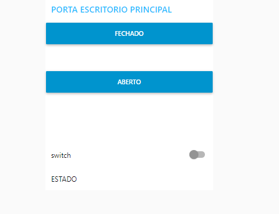

# Controle de Acesso com IoT Cloud e Indústria 4.0
- Imagem do Protótipo

- Imagem do Fluxo node-red

- Imagem do app

> Este projeto oferece um sistema de segurança avançado para escritórios, combinando uma fechadura controlada por aplicativo e um alarme acionado por um sensor de movimento. Através deste sistema, os usuários podem controlar o acesso ao escritório remotamente e em caso de invasão contará com um alarme para segurança.

## Sumário

- [Visão Geral](#visão-geral)
- [Principais Características](#principais-características) 
- [Tecnologias Utilizadas](#tecnologias-utilizadas)
- [Instalação](#instalação)
- [Exemplo de Código](#exemplo-de-código)
- [Licença](#licença)

## Visão Geral

O Sistema de Segurança para Escritório (e outros cômodos de preferência) com Fechadura por Aplicativo e Alarme de Movimento é uma solução inovadora que oferece um alto nível de segurança e controle para escritórios de todos os tamanhos. Integrando tecnologia avançada, este sistema proporciona tranquilidade aos proprietários e gestores, permitindo o gerenciamento remoto do acesso ao escritório e fornecendo alertas instantâneos em caso de atividade suspeita.

## Principais Características

  1. Controle Remoto: Abra e feche a fechadura do escritório usando um aplicativo no seu dispositivo móvel.
  2. Sensor de Movimento: Detecta qualquer movimento não autorizado dentro do espaço e ativa um alarme imediatamente.
  3. Configurações Personalizadas: Personalize as configurações do sistema para atender às necessidades específicas do seu escritório.

## Tecnologias Utilizadas

- Este projeto incorpora uma variedade de tecnologias poderosas para fornecer uma solução de segurança eficaz e flexível:

1. **Wokwi**: Plataforma de simulação de hardware que possibilita a emulação da placa ESP32, permitindo testes e desenvolvimento sem a necessidade de hardware físico. 
2. **Node-RED**: Ambiente de desenvolvimento visual para automação de Internet das Coisas (IoT), que facilita a integração e a automação de dispositivos e serviços.
3. **MQTT** (Message Queuing Telemetry Transport): Protocolo de mensagens leve e eficiente projetado para situações onde a largura de banda e a energia são críticas. É amplamente utilizado em ambientes IoT para comunicação entre dispositivos.
4. **Mosquitto**: Um broker MQTT de código aberto que facilita a troca de mensagens entre dispositivos, permitindo a comunicação eficiente e confiável.
5. **MicroPython (uPy)**: Uma implementação eficiente da linguagem Python 3 para microcontroladores, utilizada para programar a placa ESP32 e controlar o funcionamento do sistema.

## Instalação

- Siga os passos abaixo para configurar e executar o projeto de forma simulada:

1. **Simulação com Wokwi**: A simulação do hardware é realizada utilizando a plataforma Wokwi. Para iniciar a simulação, [clique aqui](https://wokwi.com/projects/378494129293306881) para acessar o ambiente Wokwi com todos os componentes e código já implementado.
2. **Configuração do Node-RED (Após fazer toda a instalação)**: Para o tutorial de instalação do Node-RED [clique aqui](https://youtu.be/EnvfbQboMs0?si=SmQzOiI7Qq055-_-). Importe o arquivo do fluxo do Node-RED fornecido no repositório. Para isso, siga os passos abaixo: Abra o Node-RED no seu navegador. Clique no menu (canto superior direito) e selecione "Import" > "Clipboard". Abra o arquivo do fluxo (`flows.json`) e copie o conteúdo. Cole o conteúdo na janela de importação do Node-RED e clique em "Import".
3. **Execução do Projeto**: Agora, seu projeto está pronto para ser testado. Após iniciar a simulação no Wokwi e ter feito a implementação no Node-RED basta aguardar a conexão ser estabelecida e ir na aba dashboard do Node-RED e entrar na página que será fornecida clicando no ícone de link.

## Exemplo de Código

O código pode ser encontrado no arquivo `index.py` para melhor visualização ele também está completamente comentado para melhor compreensão. Sinta-se à vontade para fazer um clone deste repositório ou, se preferir, você pode testar e fazer melhorias diretamente no ambiente do Wokwi.
